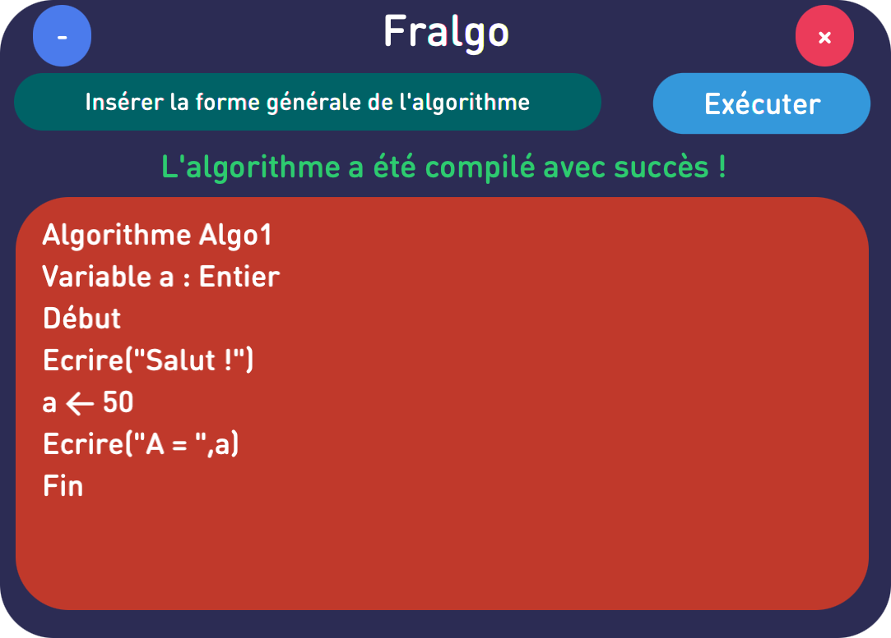
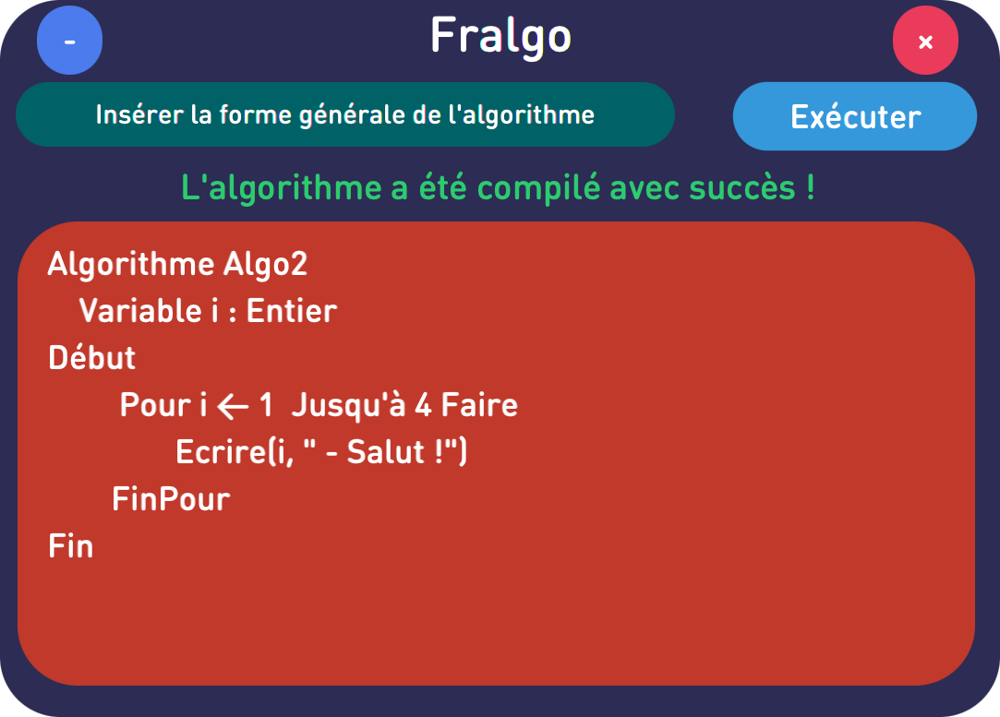

# FrAlgorithmCompiler
> This is a program for compiling and executing algorithms in French
## Installation

- Install fpc (Free Pascal Compiler) :
```shell
 brew install fpc
```
## Screenshots





## Examples


```pascal
Algorithme Algo1
    Variable a : Entier
Début
    Ecrire("Salut !")
    a ← 50
    Ecrire("A = ",a)
Fin
```

```pascal
Algorithme Algo2
    Variable i : Entier
Début
	 Pour i ← 1  Jusqu'à 4 Faire
		Ecrire(i, "- Salut !")
	FinPour
Fin
```

```pascal
Algorithme Algo3
    Variable i : Entier
Début
	 Pour i ← 1  Jusqu'à 10 Faire
		Si i mod 2 = 0 Alors
			Ecrire(i, "- Salut !")
		FinSi
	FinPour
Fin
```

