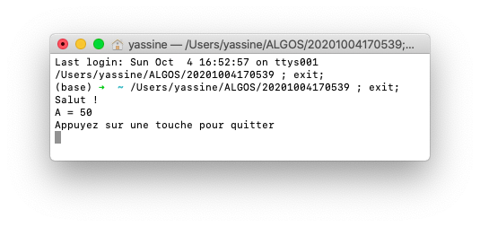
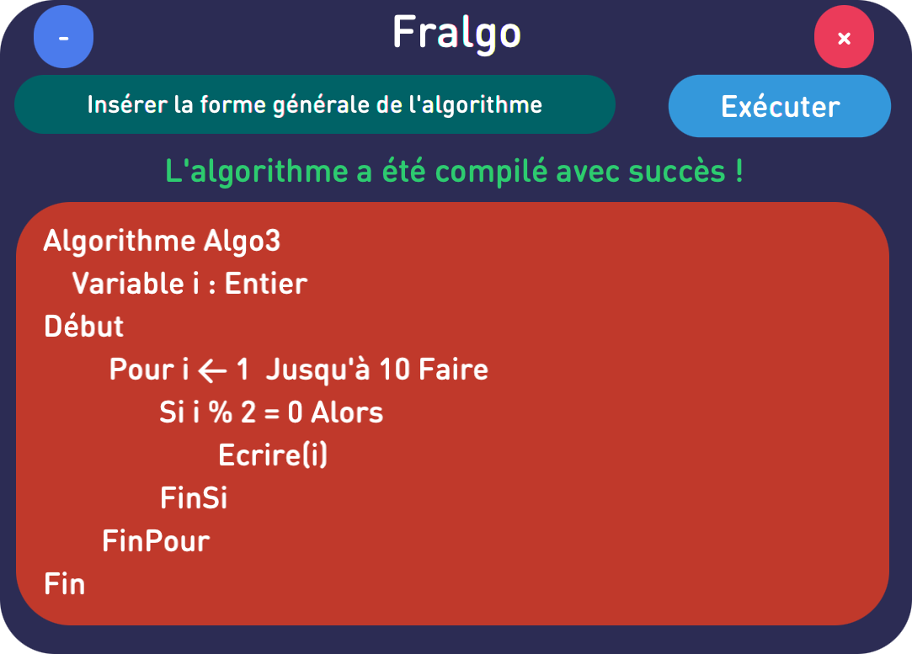
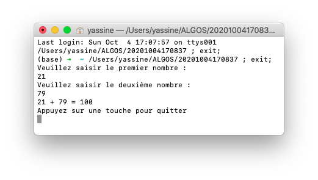

# FrAlgorithmCompiler
> A Java application for compiling and executing algorithms in French, based on Pascal


## Built With
* [JavaFX](https://openjfx.io/)
## Prerequisites :

- Install fpc (Free Pascal Compiler) :
> On MAC OS using [Homebrew](https://brew.sh/) :
```shell
brew install fpc
```
> On Linux (Ubuntu) :
```shell
sudo apt-get install fp-compiler
```
> On Windows using [Chocolatey](https://chocolatey.org/) :
```shell
choco install freepascal
```
## Screenshots :









## Examples :


```pascal
Algorithme Algo1
    Variable a : Entier
Début
    Ecrire("Salut !")
    a ← 50
    Ecrire("A = ",a)
Fin
```

```pascal
Algorithme Algo2
    Variable i : Entier
Début
	 Pour i ← 1  Jusqu'à 4 Faire
		Ecrire(i, " - Salut !")
	FinPour
Fin
```

```pascal
Algorithme Algo3
    Variable i : Entier
Début
	 Pour i ← 1  Jusqu'à 10 Faire
		Si i % 2 = 0 Alors
			Ecrire(i)
		FinSi
	FinPour
Fin
```

```pascal
Algorithme Somme
	Variable n1,n2,s : Entier
Début
	Ecrire("Veuillez saisir le premier nombre :")
	Lire(n1)
	Ecrire("Veuillez saisir le deuxième nombre :")
	Lire(n2)
	s ← n1+n2
    Ecrire(n1," + ",n2," = ",s)
Fin
```

## Contributing

Contributions are what make the open source community such an amazing place to be learn, inspire, and create. Any contributions you make are **greatly appreciated**.

1. Fork the Project
2. Create your Feature Branch (`git checkout -b feature/AmazingFeature`)
3. Commit your Changes (`git commit -m 'Add some AmazingFeature'`)
4. Push to the Branch (`git push origin feature/AmazingFeature`)
5. Open a Pull Request

## License
[Apache License 2.0](https://choosealicense.com/licenses/apache-2.0/)
## Contact
- Yassine Lafryhi - [@YassineLafryhi](https://twitter.com/YassineLafryhi) - [y.lafryhi@gmail.com](mailto:y.lafryhi@gmail.com)
- Project Link : [https://github.com/Yassine-Lafryhi/FrAlgorithmCompiler](https://github.com/Yassine-Lafryhi/FrAlgorithmCompiler)